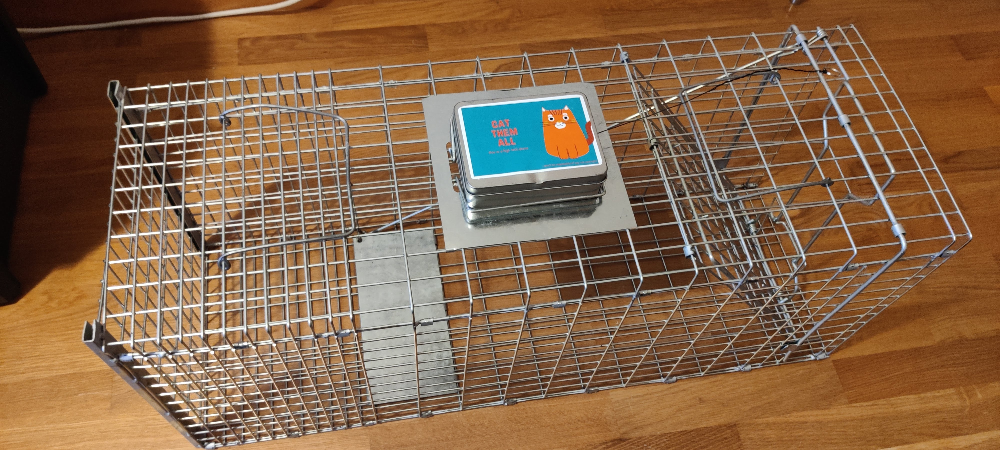
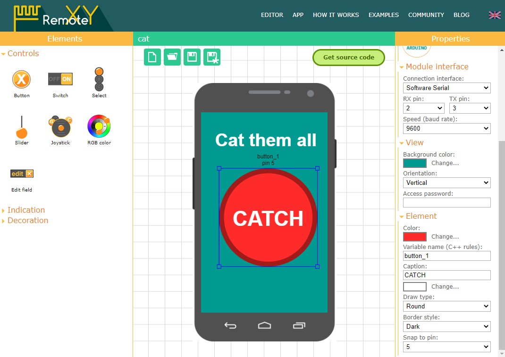
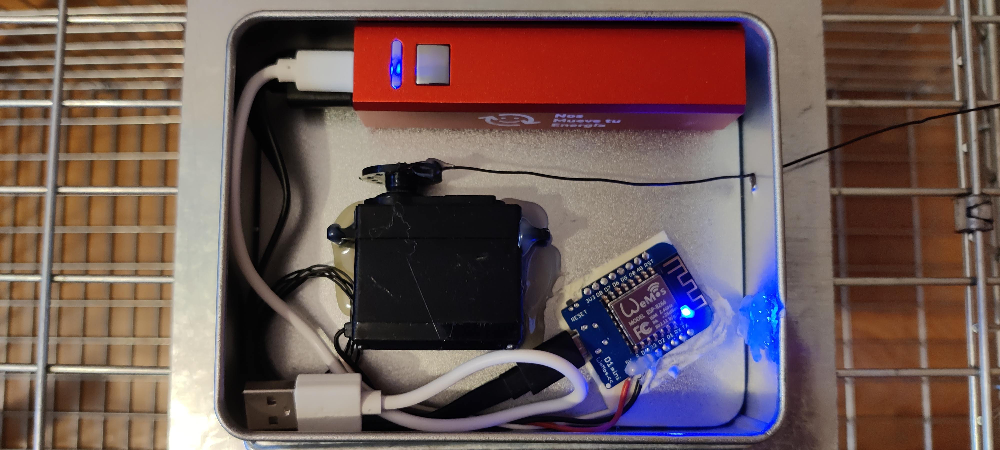
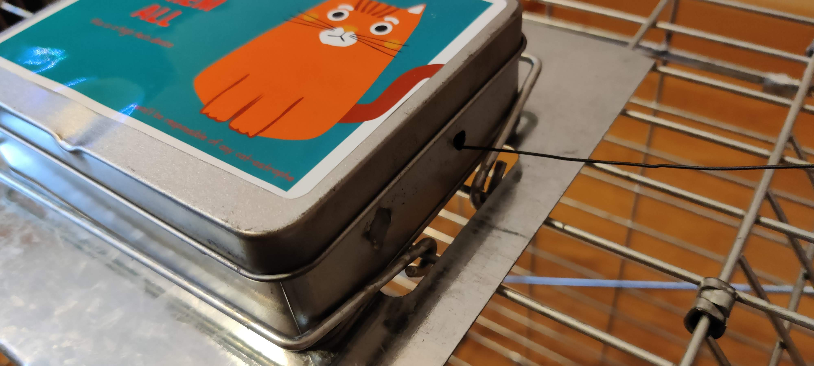
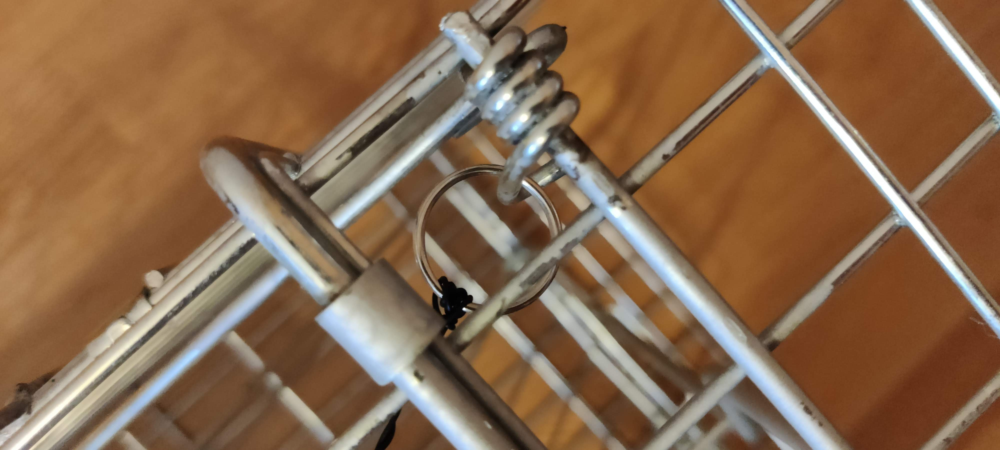
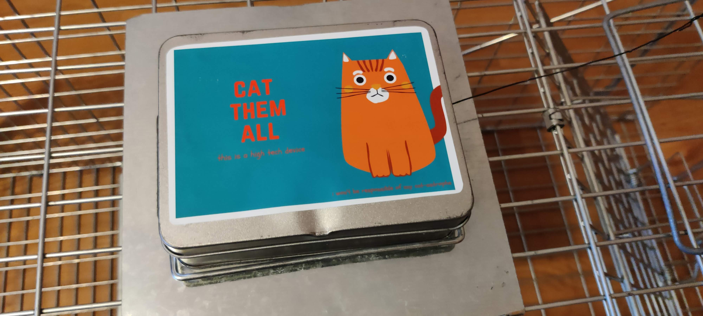

# SmartAnything
A simple diy device to make smart any ordinary object

## Motivation
Nowadays anything you can think, you can buy it with the preffix "smart", wich usually means that you can connect your phone to it to manage it remotely. But.. how can we do this with devices that we already have?

In this example I'm going to use a real life need: a friend of mine has a pet capture cage that uses to capture stray cats to cure, castrate and release them again. The cage has an mechanism that closes the door when a cat steps over a pedal inside the cage. But the cat doesn't allways steps on the pedal, or two cats go in at same time, or a cat already vaccinated falls in the trap,.. so she would like to manage the cage door remotelly.



## Generic smart device

## BOM
We will need the following materials:
- Arduino with wifi or bluetooth (can be on separate board)
- External USB battery pack
- Servo motor (check the strenght you need for your project)

In my case I used a Wemos D1 mini (with wifi), a merchandaising USB battery and a Futaba S3003 servo motor.

## The code
For this project I wanted to try [RemoteXY](https://remotexy.com/), a solution to create something like a smartphone APP for your smart device. I chose this platform over other ones like [Blynk](https://blynk.io/en/getting-started) because it does not need an internet connection and all the code and configuration of the project is on the arduino firmware.

On the [RemoteXY editor](https://remotexy.com/en/editor/) you can just create an interface and then link the UI elements to Arduino pins.



When you are done, just click on "get the code". It will generate a .ino file that you can just open with your favourite Arduino IDE. 

On the code you may want to change the wifi ssid and password that are on the first lines of the program.

To control my servo I had to tweak a bit the code using a Servo library, attaching the servo to the pin 2 (D4 on my Wemos) and controlling it when the button of the interface is pushed. Here is all my code:

```c
/*
   -- CatThemAll --
   
   This source code of graphical user interface 
   has been generated automatically by RemoteXY editor.
   To compile this code using RemoteXY library 2.4.3 or later version 
   download by link http://remotexy.com/en/library/
   To connect using RemoteXY mobile app by link http://remotexy.com/en/download/                   
     - for ANDROID 4.5.1 or later version;
     - for iOS 1.4.1 or later version;
    
   This source code is free software; you can redistribute it and/or
   modify it under the terms of the GNU Lesser General Public
   License as published by the Free Software Foundation; either
   version 2.1 of the License, or (at your option) any later version.    
*/

//////////////////////////////////////////////
//        RemoteXY include library          //
//////////////////////////////////////////////

// RemoteXY select connection mode and include library 
#define REMOTEXY_MODE__ESP8266WIFI_LIB_POINT
#include <ESP8266WiFi.h>
#include <RemoteXY.h>
#include <Servo.h>

// RemoteXY connection settings 
#define REMOTEXY_WIFI_SSID "CatThemAll"
#define REMOTEXY_WIFI_PASSWORD "12345678"
#define REMOTEXY_SERVER_PORT 6377

Servo myservo;

// RemoteXY configurate  
#pragma pack(push, 1)
uint8_t RemoteXY_CONF[] =
  { 255,1,0,0,0,37,0,10,13,1,
  1,0,8,27,49,49,37,31,67,65,
  84,67,72,0,129,0,7,10,51,9,
  31,67,97,116,32,116,104,101,109,32,
  97,108,108,0 };
  
// this structure defines all the variables and events of your control interface 
struct {

    // input variables
  uint8_t button_1; // =1 if button pressed, else =0 

    // other variable
  uint8_t connect_flag;  // =1 if wire connected, else =0 

} RemoteXY;
#pragma pack(pop)

/////////////////////////////////////////////
//           END RemoteXY include          //
/////////////////////////////////////////////

#define PIN_BUTTON_1 LED_BUILTIN


void setup() 
{
  RemoteXY_Init (); 
  
  pinMode (PIN_BUTTON_1, OUTPUT);
  
  myservo.attach(2);

  myservo.write(0);
  
}

void loop() 
{ 
  RemoteXY_Handler ();
  
  digitalWrite(PIN_BUTTON_1, (RemoteXY.button_1==0)?LOW:HIGH);

  if (RemoteXY.button_1!=0){
      myservo.write(180);
      delay(500);     
      myservo.write(0);
      delay(500);
  }
 
}
```

## Connections and packaging

I used an small metal box to hold all the components.



The wiring is super simple:
- The battery powers the arduino via USB. I left a second USB wire ready for changing the battery.
- The servo is connected to the arduino using a 5v pin, GND and D4.

The servo has a metal wire attached to it that goes out of the box through an small hole so when the servo moves it pulls from the wire.


On the other end of the wire there is a keytool ring that will trigger the closing mechanism of the cage.


I fixed the box to the cage using the handles of the cage that magically fit around the box.
